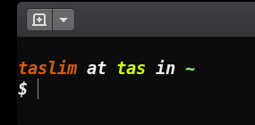

# bashrc

## Copy and Paste
1. Copy contents from .bashrc into ~/.bashrc
2. Reload the .bashrc
    > source ~/.bashrc
3. For the root user
    > sudo cp ~/.bashrc /root
4. Reload the .bashrc
    > cd /root && source ~/.bashrc